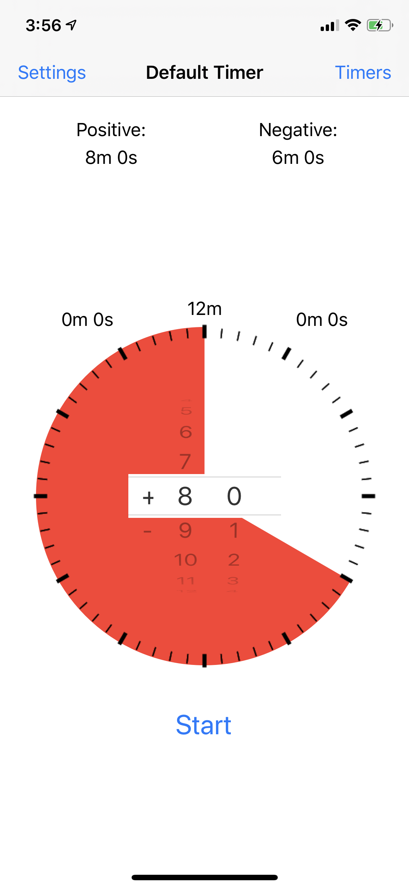
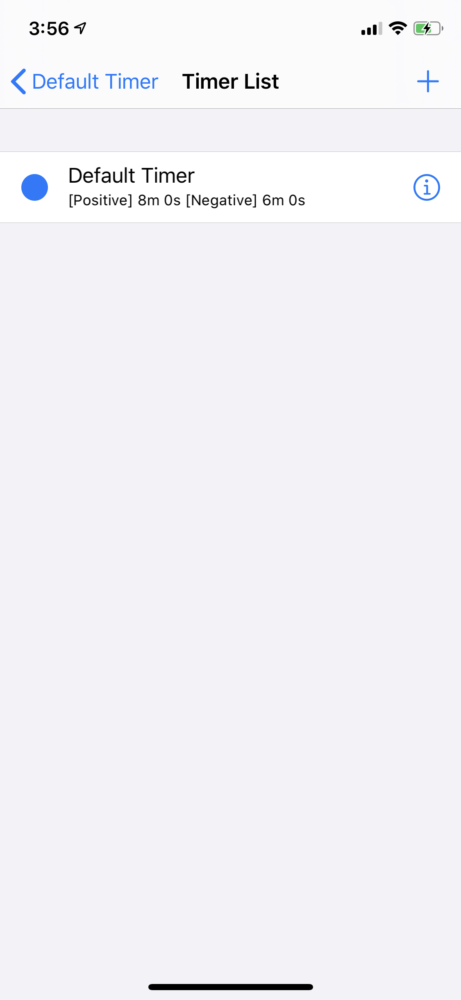
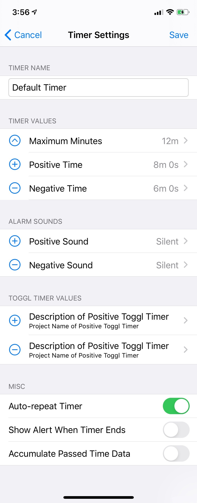

# Adjustable Pomodoro Timer
Pomodoro timer with ability change remaining time while timer is running

## Feature List
1. Able to start timer from positive and negative number
    1. Positive number denotes productive acitivity (e.g., studing)
    2. Negative number denotes unproductive activity (e.g., resting, web surfing)
2. Able to adjust remaining time while timer is running
    1. Use case: extend your study session when you are on a roll
3. Integration with Toggl
    1. Able to input user's id and password
    2. Able to start tracking user defined task when the timer starts
    3. Different user defined task for positive and negative mode
4. watchOS Support
    1. Has most feature sets of iOS counter part
    2. Able to sync user defined timers between iOS and watchOS
    3. Not Supported: active timer session is not sync between iOS and watchOS

## Build

This project does not require any external libraries

Open PomodoroTimer.xcodeproj with Xcode to build the project

## How To Use

### Timer View

* Tap **Start** button to start the time
* Upper numbers denote default positive and negative times
    * When a timer ends, timer will be automatically set to the shown values
    * If the ended timer was positive timer, timer will set to negative default time
* Middle left and right numbers denote passed positive and negative times
    * Used to track how many times have been spent doing positive and negative activities
    * If `Accumulate Passed Time Data` is not set from [Timer Settings](#timer-settings), values will reset to `0m 0s` and `0m 0s` when **Start** button is tapped
    * Values will start to increment when the timer starts
* Number on top of circular clock denotes maximum time
    * Timer can not be set beyond this value
    * Maximum time can be adjusted by tapping **Timers** button on upper right
* Circular pie or use time picker can be used to adjust timer
    * Adjusting remaining time can be done before or after **Start** button has been tapped
    * Red pie denotes positive timer and blue pie denotes negative timer
    * Switch between red and blue pie by dragging circular pie pass the `0m` point (or 12 o'clock )
* Tapped **Timers** button on upper right to view list of timers and modify timer settings

### Timer List View

* Tap **+** button to create a new timer
* Tap **ⓘ** button to modify existing timer
* Select timer for the list
    * Selected timer will have filled circle on the left
    * When back button is tapped, values in **Timer View** will be changed accordingly
 * Swipe left on a timer to delete it

### Timer Settings View

* Use textfield **Timer Name** to set the timer name
* Use **Timer Values** to set maximumm, default positive, default negative time
* Use **Alarm Sounds** to set the sound when timer finishes
    * Use `Silent` to have no sound playing
* Use **Toggl Timer Values** to define toggl timers played when timer starts
    * If user is not log in via **Settings** screen, app will alert user
    * **Settings** screen can be accessed from [Timer View](#timer-view)
* Use **Misc** to set additional settings 
    * If `Auto-repeat Timer` is set, negative or positive timer will start automatically when a timer reaches `0m 0s`
    * If `Show Alert When Timer Ends` is set, user will be notified via pop up when timer finishes
    * If `Accumulate Passed Time Data` is set, `passed time` from [Timer View](#timer-view) will not reset to `0m 0s` when **Start** is tapped again

## Notes

* As the app is not available in App Store, Apple developer profile is required
* App was tested with iPhone 11 Pro
    * UI might not scale correctly with phones of different size
* Clock Outline was modified from [pngwave.com](https://www.pngwave.com/png-clip-art-tpygv)

